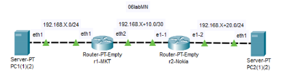

# Lab 06 Ruter Mikrotik i Nokia

## Escenari:



| Dispositiu | Interfície  | @IP                 |
| ---------- | ------------ | ------------------- |
| PC1        | eth1         | 192.168.X.1/24      |
| PC2        | eth1         | 192.168.X+20.1/24   |
| R1_MKT     | ether2       | 192.168.X.254/24    |
|            | ether3       | 192.168.X+10.1/30   |
| R2_Nokia   | ethernet-1/1 | 192.168.X+10.2/30   |
|            | ethernet-1/2 | 192.168.X+20.254/24 |

## Fitxer .yml

Crear un fitxer dintre de la carpeta **clab/06labMN/** anomenat **06labMN.yml**.

```shell
nano /clab/06labMN/06labMN.yml
```

Inserir el següent codi a l'interior del fitxer .yml.

```yml
name: 06labMN

topology:
  nodes:

    pc1:
      kind: linux
      image: yobasystems/alpine-nginx
      exec:
        - apk add sudo
        - apk add curl
        - apk add tcpdump
    r1_mkt:
      kind: vr-ros
      image: vrnetlab/vr-routeros:7.12.1
    r2_nokia:
      kind: nokia_srlinux
      image: ghcr.io/nokia/srlinux:latest
    pc2:
      kind: linux
      image: yobasystems/alpine-nginx
      exec:
        - apk add sudo
        - apk add curl
        - apk add tcpdump
        - sudo ip route delete default
  links:
    - endpoints: ["pc1:eth1","r1_mkt:eth1"]
    - endpoints: ["r1_mkt:eth2","r2_nokia:e1-1"]
    - endpoints: ["r2_nokia:e1-2","pc2:eth1"]
```

## Executar instància **Clab**

Per a iniciar la instància executarem la seguent comanda:

```shell
sudo clab deploy -t /clab/06labMN/06labMN.yml
```


## Configuració PC1

### Conectar-se

Connectar-se al PC 1 mitjançant la següent comanda.

```shell
sudo docker exec -it clab-06labMN-pc1 /bin/sh
```

### Configuració IP

En primer lloc, necessitarem saber el nom de la interfície on realitzarem la configuració.

```shell
ip address
```

Ara recordarem el nom de la interfície a la qual volem realitzar-li la configuració.

```shell
1: lo: <LOOPBACK,UP,LOWER_UP> mtu 65536 qdisc noqueue state UNKNOWN qlen 1000
    link/loopback 00:00:00:00:00:00 brd 00:00:00:00:00:00
    inet 127.0.0.1/8 scope host lo
       valid_lft forever preferred_lft forever
    inet6 ::1/128 scope host
       valid_lft forever preferred_lft forever
30: eth0@if31: <BROADCAST,MULTICAST,UP,LOWER_UP,M-DOWN> mtu 1500 qdisc noqueue state UP
    link/ether 02:42:ac:14:14:05 brd ff:ff:ff:ff:ff:ff
    inet 172.20.20.5/24 brd 172.20.20.255 scope global eth0
       valid_lft forever preferred_lft forever
    inet6 2001:172:20:20::5/64 scope global flags 02
       valid_lft forever preferred_lft forever
    inet6 fe80::42:acff:fe14:1405/64 scope link
       valid_lft forever preferred_lft forever
35: eth1@if34: <BROADCAST,MULTICAST,UP,LOWER_UP,M-DOWN> mtu 9500 qdisc noqueue state UP
    link/ether aa:c1:ab:33:fa:33 brd ff:ff:ff:ff:ff:ff
    inet6 fe80::a8c1:abff:fe33:fa33/64 scope link
       valid_lft forever preferred_lft forever
```

Com podem veure la interfície a la que voldrem assignar-li una endreça serà la **eth1**. Ara li assignarem una adreça IP.

```shell
ip address add 192.168.X.1/24 dev eth1
```

### Configuració Encaminament Estàtic

A continuació volem configurar l'encaminament estàtic per tal que el nostre equip pugui connectar-se amb les altres xarxes. Per a fer-ho executarem la comanda següent:

```shell
ip route add 192.168.X+10.0/30 via 192.168.X.254
ip route add 192.168.X+20.0/24 via 192.168.X.254
```

### Modificar WEB

Per a modificar la Web haurem d'accedir al fitxer **index.html** que es troba en el directori **/etc/nginx/html/**

```shell
vi /etc/nginx/html/index.html
```

Per a editar el fitxer pressionarem la lletra *I* i el modifiquem com nosaltres vulguem.

```html
<!DOCTYPE html>
<html>
    <head>
        <title>CnomXX</title>
        <style>
            body {
                width: 35em;
                margin: 0 auto;
                font-family: Tahoma, Verdana, Arial, sans-serif;
            }
        </style>
    </head>
    <body>
        <h1>This is Nom Cognoms Web</h1>
    </body>
</html>
```

Un cop hem editat el fitxer pressionam *Esc* i **escrivim :**wq per a guardar i sortir.


## Configuració PC2

### Conectar-se

Connectar-se al PC 2 mitjançant la següent comanda.

```shell
sudo docker exec -it clab-06labMN-pc1 /bin/sh
```

### Configuració IP

En primer lloc, necessitarem saber el nom de la interfície on realitzarem la configuració.

```shell
ip address
```

Ara recordarem el nom de la interfície a la qual volem realitzar-li la configuració.

```shell
1: lo: <LOOPBACK,UP,LOWER_UP> mtu 65536 qdisc noqueue state UNKNOWN qlen 1000
    link/loopback 00:00:00:00:00:00 brd 00:00:00:00:00:00
    inet 127.0.0.1/8 scope host lo
       valid_lft forever preferred_lft forever
    inet6 ::1/128 scope host
       valid_lft forever preferred_lft forever
22: eth0@if23: <BROADCAST,MULTICAST,UP,LOWER_UP,M-DOWN> mtu 1500 qdisc noqueue state UP
    link/ether 02:42:ac:14:14:02 brd ff:ff:ff:ff:ff:ff
    inet 172.20.20.2/24 brd 172.20.20.255 scope global eth0
       valid_lft forever preferred_lft forever
    inet6 2001:172:20:20::2/64 scope global flags 02
       valid_lft forever preferred_lft forever
    inet6 fe80::42:acff:fe14:1402/64 scope link
       valid_lft forever preferred_lft forever
26: eth1@if27: <BROADCAST,MULTICAST,UP,LOWER_UP,M-DOWN> mtu 9500 qdisc noqueue state UP
    link/ether aa:c1:ab:a9:e4:8c brd ff:ff:ff:ff:ff:ff
    inet6 fe80::a8c1:abff:fea9:e48c/64 scope link
       valid_lft forever preferred_lft forever
```

Com podem veure la interfície a la que voldrem assignar-li una endreça serà la **eth1**. Ara li assignarem una adreça IP.

```shell
ip address add 192.168.X+20.1/24 dev eth1
```

### Configuració Encaminament Estàtic

A continuació volem configurar l'encaminament estàtic per tal que el nostre equip pugui connectar-se amb les altres xarxes. Per a fer-ho executarem la comanda següent:

```shell
ip route add 192.168.X+10.0/30 via 192.168.X+20.254
ip route add 192.168.X.0/24 via 192.168.X+20.254
```


## Configuració Rúter Mikrotik

### Conectar-se

Connectar-se al Rúter-MKT mitjançant la següent comanda.

```shell
sudo ssh admin@clab-06labMN-r1_mkt
```

La contrasenya és: **admin**

### Configuració Interfícies

Per a configura'ls una adreça IP a les interfícies del rúter haurem de fer ús de la següents comandes.

```shell
/ip address add address=192.168.x.254/24 interface=ether2 network=192.168.x.0
/ip address add address=192.168.x+10.1/30 interface=ether3 network=192.168.x+10.0
```

### Configuració Encaminament Estàtic

A continuació volem configurar l'encaminament estàtic per tal que el nostre rúter pugui connectar-se amb les altres xarxes que no estan directement conectades. Per a fer-ho executarem la comanda següent:

```shell
/ip route add dst-address=192.168.X+20.0/24 gateway=192.168.X+10.2
```


## Configuració Rúter Nokia

### Conectar-se

Connectar-se al Rúter-Nokia mitjançant la següent comanda.

```shell
sudo ssh admin@clab-06labMN-r2_nokia
```

La contrasenya és: **NokiaSrl1!**

### Configuració Interfícies

Per a configura el rúter nokia per aquest laboratori haurem d'executar les seguents comandes.

```shell
enter candidate
set / interface ethernet-1/1
set / interface ethernet-1/1 admin-state enable
set / interface ethernet-1/1 subinterface 0 admin-state enable
set / interface ethernet-1/1 subinterface 0 ipv4 admin-state enable
set / interface ethernet-1/1 subinterface 0 ipv4 address 192.168.X+10.2/30
set / interface ethernet-1/2
set / interface ethernet-1/2 admin-state enable
set / interface ethernet-1/2 subinterface 0 admin-state enable
set / interface ethernet-1/2 subinterface 0 ipv4 admin-state enable
set / interface ethernet-1/2 subinterface 0 ipv4 address 192.168.X+20.254/24
set / network-instance default interface ethernet-1/1.0
set / network-instance default interface ethernet-1/2.0
commit now
```

### Configuració Encaminament Estàtic

A continuació volem configurar l'encaminament estàtic per tal que el nostre rúter pugui connectar-se amb les altres xarxes que no estan directement conectades. Per a fer-ho executarem la comanda següent:

```shell
enter candidate
set /network-instance default next-hop-groups group GW1 nexthop 1000 ip-address 192.168.X+10.1
set /network-instance default static-routes route 192.168.X.0/24 next-hop-group GW1
commit now
```


## Activitat

Un cop realitzades les configuracions en els quatre dispositius haurem de executar la tracert.

PC1: `traceroute -n 192.168.X+20.1`

PC2: `traceroute -n 192.168.X.1`

I desde el PC2 haurem de executar un curl per a veure el contingut del servei Web que hi ha en el PC1

```shell
curl http://192.168.X.1
```
