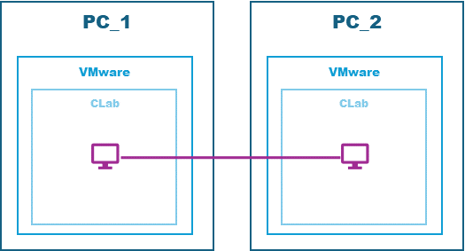
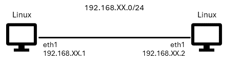
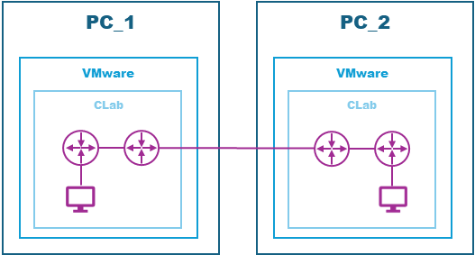
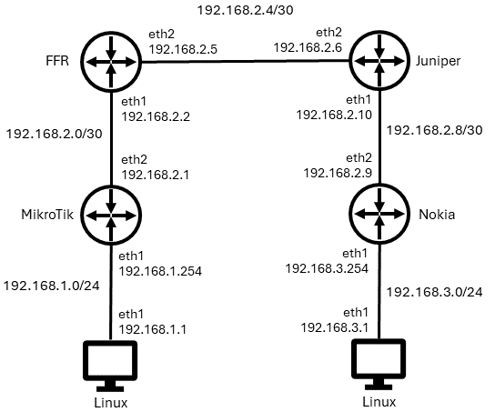

# Connectar diferents equips

## Escenari 1: MacVlan





### PC 1:

El primer lloc haurem d'anar a la configuració de la nostra màquina virtual a **VMware** i col·locar l'adaptador de xarxa en Bridge.

A continuació encendrem la nostra màquina Virtual

Un cop estigui encesa ens assegurarem que tingui una adreça IP i recordarem l'adaptador amb el qual treballem.

```shell
ip a
...
3: ens36: <BROADCAST,MULTICAST,UP,LOWER_UP> mtu 1500 qdisc fq_codel state UP group default qlen 1000
    link/ether 00:0c:29:a4:8d:15 brd ff:ff:ff:ff:ff:ff
    altname enp2s4
    inet 192.168.0.35/24 brd 192.168.0.255 scope global dynamic ens36
       valid_lft 82585sec preferred_lft 82585sec
    inet6 fe80::20c:29ff:fea4:8d15/64 scope link
       valid_lft forever preferred_lft forever
...
```

Ens desplaçarem al directori **clab** `cd clab` i en ell crearem una nova carpeta anomenada **01inter** `mkdir 01inter` després ens desplaçarem a l'interior d'aquest nou directori `cd 01inter` i crearem un nou fitxer anomenat 01inter.yml 'nano 01inter.yml'.

En l'interior del fitxer escriurem el seguent codi:

```yml
name: 01inter

topology:
  nodes:
    pc_a:
      kind: linux
      image: yobasystems/alpine-nginx
      exec:
        - apk add sudo
        - apk add curl
        - apk add traceroute
        - ip address add 192.168.6.1/24 dev eth1

  links:
    - endpoints: ["pc_a:eth1", "macvlan:ens36"]
```

**Nota**: Al endpoint **macvlan** cal col·locar el nom de la interfície que està en Bridge

Ara ens quedarà activar el contenidor

```
sudo clab deploy -t 01inter.yml
...
Run 'containerlab version upgrade' to upgrade or go check other installation options at https://containerlab.dev/install/
+---+------------------+--------------+--------------------------+-------+---------+----------------+----------------------+
| # |       Name       | Container ID |          Image           | Kind  |  State  |  IPv4 Address  |     IPv6 Address     |
+---+------------------+--------------+--------------------------+-------+---------+----------------+----------------------+
| 1 | clab-01inter-pc_a | 2f3a1da2bb11 | yobasystems/alpine-nginx | linux | running | 172.20.20.2/24 | 2001:172:20:20::2/64 |
+---+------------------+--------------+--------------------------+-------+---------+----------------+----------------------+
```

I després ens connectarem al **pc_a**

```
sudo docker exec -it clab-01inter-pc_a /bin/sh
```

Un cop hem accedit al pc_a podem comprovar que tenim l'adreça IP que hem configurat al fitxer .yml fent ús de la comanda `ifconfig`

```
ifconfig
...
eth1      Link encap:Ethernet  HWaddr AA:C1:AB:BE:F2:A7
          inet addr:192.168.6.1  Bcast:0.0.0.0  Mask:255.255.255.0
          inet6 addr: fe80::a8c1:abff:febe:f2a7/64 Scope:Link
          UP BROADCAST RUNNING MULTICAST  MTU:1500  Metric:1
          RX packets:238 errors:0 dropped:0 overruns:0 frame:0
          TX packets:19 errors:0 dropped:0 overruns:0 carrier:0
          collisions:0 txqueuelen:0
          RX bytes:17108 (16.7 KiB)  TX bytes:1466 (1.4 KiB)
...
```

Un cop el pc_b ha estat activat a l'altre equip podem comprovar que tenen connectivitat realitzant un `ping`

```
ping 192.168.6.2
PING 192.168.6.2 (192.168.6.2): 56 data bytes
64 bytes from 192.168.6.2: seq=0 ttl=64 time=1.521 ms
64 bytes from 192.168.6.2: seq=1 ttl=64 time=1.185 ms
--- 192.168.6.2 ping statistics ---
2 packets transmitted, 2 packets received, 0% packet loss
round-trip min/avg/max = 1.185/1.353/1.521 ms
```

### PC 2:

El primer lloc haurem d'anar a la configuració de la nostra màquina virtual a **VMware** i col·locar l'adaptador de xarxa en Bridge.

A continuació encendrem la nostra màquina Virtual

Un cop estigui encesa ens assegurarem que tingui una adreça IP i recordarem l'adaptador amb el qual treballem.

```shell
ip a
...
3: ens34: <BROADCAST,MULTICAST,UP,LOWER_UP> mtu 1500 qdisc fq_codel state UP group default qlen 1000
    link/ether 00:0c:29:d4:7a:32 brd ff:ff:ff:ff:ff:ff
    altname enp2s4
    inet 192.168.0.34/24 brd 192.168.0.255 scope global dynamic ens36
       valid_lft 82585sec preferred_lft 82585sec
    inet6 fe80::20c:29ff:fea4:7a32/64 scope link
       valid_lft forever preferred_lft forever
...
```

Ens desplaçarem al directori **clab** `cd clab` i en ell crearem una nova carpeta anomenada **01inter** `mkdir 01inter` després ens desplaçarem a l'interior d'aquest nou directori `cd 01inter` i crearem un nou fitxer anomenat 01inter.yml 'nano 01inter.yml'.

En l'interior del fitxer escriurem el seguent codi:

```yml
name: 01inter

topology:
  nodes:
    pc_b:
      kind: linux
      image: yobasystems/alpine-nginx
      exec:
        - apk add sudo
        - apk add curl
        - apk add traceroute
        - ip address add 192.168.6.2/24 dev eth1

  links:
    - endpoints: ["pc_b:eth1", "macvlan:ens34"]
```

**Nota**: Al endpoint **macvlan** cal col·locar el nom de la interfície que està en Bridge

Ara ens quedarà activar el contenidor

```
sudo clab deploy -t 01inter.yml
...
Run 'containerlab version upgrade' to upgrade or go check other installation options at https://containerlab.dev/install/
+---+-------------------+--------------+--------------------------+-------+---------+----------------+----------------------+
| # |       Name        | Container ID |          Image           | Kind  |  State  |  IPv4 Address  |     IPv6 Address     |
+---+-------------------+--------------+--------------------------+-------+---------+----------------+----------------------+
| 1 | clab-01inter-pc_b | 7bb5c95ea950 | yobasystems/alpine-nginx | linux | running | 172.20.20.2/24 | 2001:172:20:20::2/64 |
+---+-------------------+--------------+--------------------------+-------+---------+----------------+----------------------+
```

I després ens connectarem al **pc_b**

```
sudo docker exec -it clab-01inter-pc_b /bin/sh
```

Un cop el pc_a ha estat activat a l'altre equip podem comprovar que tenen connectivitat realitzant un `ping`

```
ping 192.168.6.1
PING 192.168.6.1 (192.168.6.1): 56 data bytes
64 bytes from 192.168.6.1: seq=0 ttl=64 time=1.420 ms
64 bytes from 192.168.6.1: seq=1 ttl=64 time=1.440 ms
--- 192.168.6.1 ping statistics ---
2 packets transmitted, 2 packets received, 0% packet loss
round-trip min/avg/max = 1.0725/1.312/1.440 ms
```

---

## Escenari 2: VxLan





### PC 1:

En aquest cas el fitxer .yml l'anomenarem pc1MF.yml

```yml
name: pc1MF

topology:
  nodes:
    pc_a:
      kind: linux
      image: yobasystems/alpine-nginx
      exec:
        - apk add sudo
        - apk add curl
        - apk add tcpdump
        - apk add traceroute
        - ip address add 192.168.1.1/24 dev eth1
    mk:
      kind: vr-ros
      image: vrnetlab/vr-routeros:7.12.1
    frr:
      kind: linux
      image: frrouting/frr:v8.4.1
      binds:
        - frr/daemons:/etc/frr/daemons
      exec:
        - sysctl -w net.ipv4.ip_forward=1

  links:
    - endpoints: ["pc_a:eth1","mk:eth1"]
    - endpoints: ["mk:eth2","frr:eth1"]
    - endpoints: ["frr:eth2","host:vx1"]
```

**Nota:** Important crear una carpeta al interior de la del projecte anomenada frr i en el seu interior inserir el fitxer [daemons](src/daemons)

Inicialitzem el contenidor i despres creem una vxlan entre el PC1 i el PC2

```
sudo clab tools vxlan create --remote {ip-PC2} --id 10 --link vx1
```

Configuracio PC (pc_a)

```
ip route add 192.168.2.0/29 via 192.168.1.254
ip route add 192.168.2.8/30 via 192.168.1.254
ip route add 192.168.3.0/24 via 192.168.1.254
```

Configuracio Router MikroTik (mk)

```
ip address add address=192.168.1.254/24 interface=ether2
ip address add address=192.168.2.1/30 interface=ether3
ip route add dst-address=0.0.0.0/0 gateway=192.168.2.2
```

Configuracio Router FRR (frr)

```
configure terminal
interface eth1
ip address 192.168.2.2/30
exit
interface eth2
ip address 192.168.2.5/30
exit
ip route 192.168.1.0/24 192.168.2.1
ip route 192.168.2.8/30 192.168.2.6
ip route 192.168.3.0/24 192.168.2.6
do wr
```

### PC 2:

Ara crearem el segon fitxer .yml al qual anomenarem pc2JN.yml

```yml
name: pc2JN

topology:
  nodes:
    pc_b:
      kind: linux
      image: yobasystems/alpine-nginx
      exec:
        - apk add sudo
        - apk add curl
        - apk add tcpdump
        - apk add traceroute
        - ip address add 192.168.3.1/24 dev eth1
    nokia:
      kind: nokia_srlinux
      image: ghcr.io/nokia/srlinux:latest
    juni:
      kind: juniper_vmx
      image: vrnetlab/vr-vmx:18.2R1.9

  links:
    - endpoints: ["pc_b:eth1","nokia:e1-1"]
    - endpoints: ["nokia:e1-2","juni:eth1"]
    - endpoints: ["juni:eth2","host:vx2"]
```

Inicialitzem el contenidor i despres creem una vxlan entre el PC1 i el PC2

```
sudo clab tools vxlan create --remote {ip-PC1} --id 10 --link vx1
```

Configuracio PC (pc_b)

```
ip route add 192.168.1.0/24 via 192.168.3.254
ip route add 192.168.2.0/29 via 192.168.3.254
ip route add 192.168.2.8/30 via 192.168.3.254
```

Configuracio Router Nokia (nokia)

```
enter candidate
set / interface ethernet-1/1
set / interface ethernet-1/1 admin-state enable
set / interface ethernet-1/1 subinterface 0 admin-state enable
set / interface ethernet-1/1 subinterface 0 ipv4 admin-state enable
set / interface ethernet-1/1 subinterface 0 ipv4 address 192.168.2.10/30
set / interface ethernet-1/2
set / interface ethernet-1/2 admin-state enable
set / interface ethernet-1/2 subinterface 0 admin-state enable
set / interface ethernet-1/2 subinterface 0 ipv4 admin-state enable
set / interface ethernet-1/2 subinterface 0 ipv4 address 192.168.2.6/30
set / network-instance default interface ethernet-1/1.0
set / network-instance default interface ethernet-1/2.0
set /network-instance default next-hop-groups group GW1 nexthop 1000 ip-address 192.168.2.10
set /network-instance default static-routes route 192.168.1.0/24 next-hop-group GW1
set /network-instance default static-routes route 192.168.2.0/29 next-hop-group GW1
commit now
```

Configuracio Router Juniper (juni)

```
configure
set interfaces ge-0/0/0 unit 0 family inet address 192.168.2.10/30
set interfaces ge-0/0/1 unit 0 family inet address 192.168.2.6/30
set routing-options static route 192.168.1.0/24 next-hop 192.168.2.5
set routing-options static route 192.168.2.0/30 next-hop 192.168.2.5
set routing-options static route 192.168.3.0/24 next-hop 192.168.2.9
commit
```

Un cop hem acavat destruim les VxLan's que em creat fent us de la comanda seguent:

```
sudo clab tools vxlan delete
```
